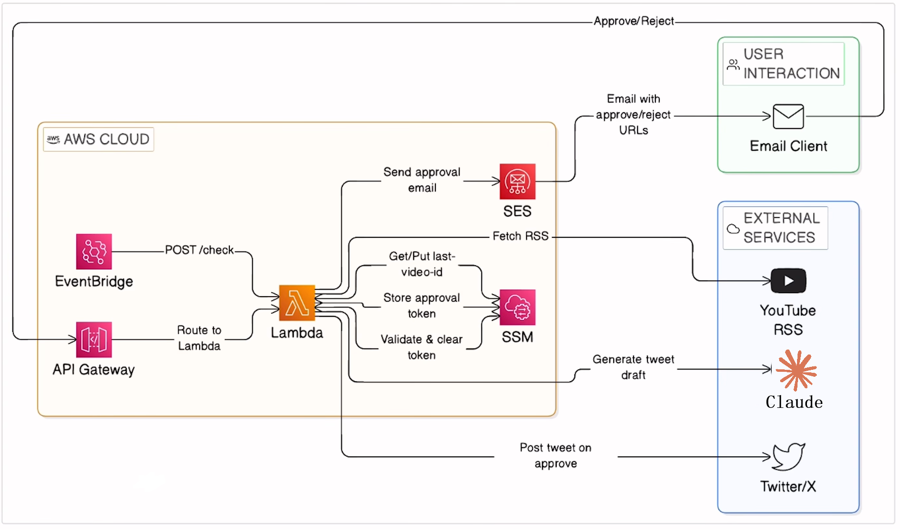

# Youtube-X-Bot

A serverless automation pipeline on AWS that monitors YouTube RSS feeds, generates tweet drafts with Claude AI, and publishes them to X (Twitter) after human approval via email.

## Architecture



### How it works

| Step | Component | Action |
|------|-----------|--------|
| 1 | **EventBridge** | Triggers Lambda every ~10 minutes |
| 2 | **YouTube RSS** | Lambda fetches latest video from channel feed |
| 3 | **SSM** | Checks `last_video_id` — skips if already posted |
| 4 | **Claude AI** | Generates a punchy tweet draft from the video title & description |
| 5 | **Amazon SES** | Sends approval email with one-click Approve / Reject links |
| 6 | **API Gateway** | Routes the user's click back to Lambda |
| 7 | **Twitter/X** | On approve — tweet is posted and `last_video_id` is updated |

## Quick Start

```bash
python -m venv venv && venv\Scripts\activate
pip install -r requirements.txt
cp .env.example .env        # fill in all keys
python manage.py migrate
python -m services.local_server      # trigger pipeline + start approval server
```

Use [ngrok](https://ngrok.com) to expose the local server and set `APPROVAL_BASE_URL` in `.env` to test approve/reject links end-to-end.

## Tech Stack

| Layer | Technology |
|-------|-----------|
| Runtime | Python 3.11 |
| Web framework | Django 5 |
| Serverless deployment | Zappa (AWS Lambda) |
| Scheduling | AWS EventBridge |
| AI | Anthropic Claude (`claude-sonnet-4-6`) |
| Social | Tweepy (Twitter/X API v2) |
| Email | Amazon SES |
| State | AWS SSM Parameter Store |
| RSS | feedparser |

## Environment Variables

Copy `.env.example` to `.env` and fill in:

```
ANTHROPIC_API_KEY
TWITTER_API_KEY / SECRET / ACCESS_TOKEN / ACCESS_TOKEN_SECRET
YOUTUBE_CHANNEL_ID
AWS_REGION
SES_SENDER_EMAIL / SES_APPROVER_EMAIL
APPROVAL_BASE_URL
DJANGO_SECRET_KEY
```

## Deployment

```bash
bash deploy.sh
```

## Docs

- [API Reference](docs/api.md) — all external APIs used
