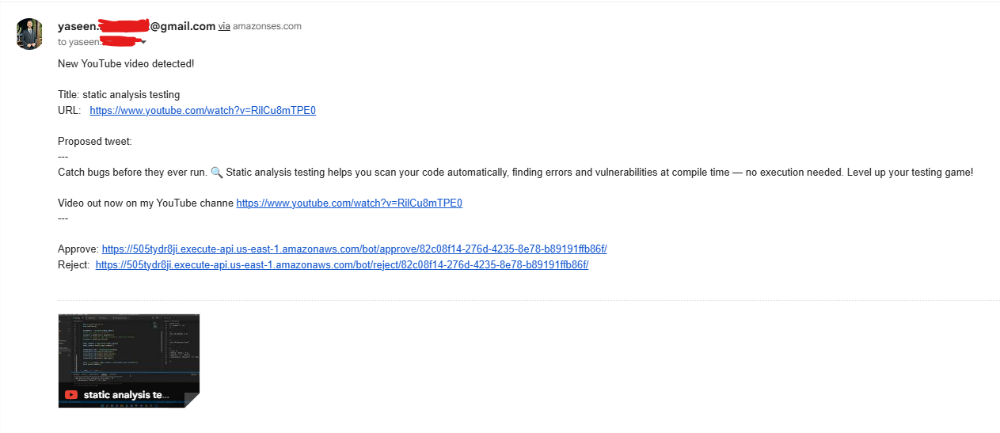
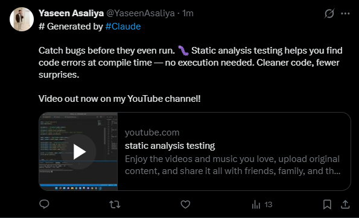

# Youtube-X-Bot

A serverless automation pipeline on AWS that monitors YouTube RSS feeds, generates tweet drafts with Claude AI, and publishes them to X (Twitter) after human approval via email. Built and deployed with the help of Claude — from architecture design to deployment — completing the full project in just 6 hours of work.
## Architecture


### Post Tweet Approval Email



### Tweet




### How it works

| Step | Component | Action |
|------|-----------|--------|
| 1 | **EventBridge** | Triggers Lambda every ~10 minutes |
| 2 | **YouTube RSS** | Lambda fetches latest video from channel feed |
| 3 | **SSM** | Checks `last_video_id` — skips if already posted |
| 4 | **Claude AI** | Generates a punchy tweet draft from the video title & description |
| 5 | **Amazon SES** | Sends approval email with one-click Approve / Reject links |
| 6 | **API Gateway** | Routes the user's click back to Lambda |
| 7 | **Twitter/X** | On approve — tweet is posted and `last_video_id` is updated |

## Quick Start

```bash
python -m venv venv && venv\Scripts\activate
pip install -r bot/docs/requirements.txt
cp bot/docs/.env.example .env   # fill in all keys
python -m bot.services.local_server      # trigger pipeline + start approval server
```

Use [ngrok](https://ngrok.com) to expose the local server and set `APPROVAL_BASE_URL` in `.env` to test approve/reject links end-to-end.

## Tech Stack

| Layer | Technology |
|-------|-----------|
| Runtime | Python 3.11 |
| Web framework | Django 5 |
| Serverless deployment | Zappa (AWS Lambda) |
| Scheduling | AWS EventBridge |
| AI | Anthropic Claude (`claude-sonnet-4-6`) |
| Social | Tweepy (Twitter/X API v2) |
| Email | Amazon SES |
| State | AWS SSM Parameter Store |
| RSS | feedparser |

## Environment Variables

Copy `bot/docs/.env.example` to `.env` and fill in.


## What I Learned

- **SSM as a zero-config state store** — for a low-traffic serverless pipeline, SSM Parameter Store eliminates the need for a database entirely; it's just enough persistence without the operational overhead
- **Human-in-the-loop via email links is deceptively simple** — one-click approve/reject over SES + API Gateway is trivially easy to implement and keeps a human meaningfully in control of what gets published
- **Zappa removes most of the Lambda friction** — packaging a Django app as a Lambda function with API Gateway in front of it is nearly a one-liner once Zappa is configured
- **Building with Claude compresses the feedback loop dramatically** — the full working pipeline (architecture → code → deployment) came together in ~6 hours, with Claude handling first drafts of everything from IAM policy to tweet prompt engineering

## At Scale, I Would...

- **Replace SSM with DynamoDB** for pending approvals — SSM has API rate limits and isn't designed for high-frequency reads/writes; DynamoDB scales without throttling and supports TTL-based expiry natively
- **Add token expiry** — approval links currently never expire; at scale a stale link clicked days later could post outdated content, so a TTL field on the approval record is essential
- **Add a Dead Letter Queue (SQS DLQ)** on the Lambda so failed pipeline runs don't silently disappear — errors surface for retry or alerting
- **Support multiple channels** via a DynamoDB config table rather than a single `YOUTUBE_CHANNEL_ID` env var, letting the same pipeline fan out across many creators
- **Add CloudWatch alarms** for Lambda error rate, SES bounce/complaint rate, and approval links that go unclicked for >24 hours
- **Move to Secrets Manager** over SSM SecureString for credentials — better rotation support and audit logging out of the box

